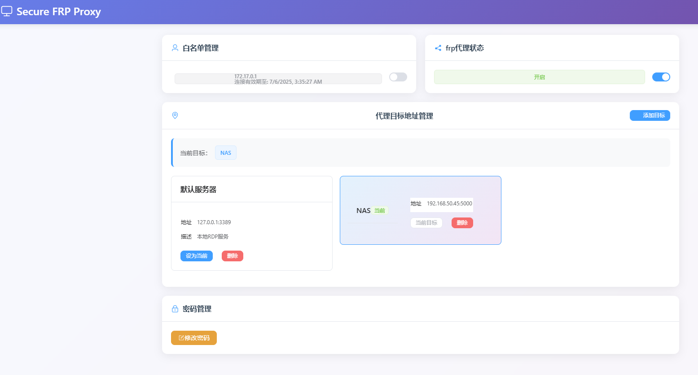

# Secure-Frp-Proxy

一个强大的TCP代理网关工具，基于Node.js开发，提供Web界面进行多协议代理管理和frpc内网穿透服务。



## ✨ 功能特性

### 🌐 TCP代理网关

- **多协议支持**：支持RDP、SSH、HTTP、HTTPS等多种TCP协议代理
- **动态目标切换**：支持配置多个代理目标，实时切换
- **Proxy Protocol v2**：完整支持HAProxy Proxy Protocol v2协议
- **智能路由**：根据客户端请求自动路由到对应目标服务

### 🔐 安全防护

- **IP白名单**：支持静态和动态IP白名单管理
- **访问控制**：基于IP地址的访问权限控制
- **连接日志**：详细的连接日志记录和监控
- **安全认证**：Web界面Basic Auth认证保护

### 🚀 代理管理

- **frpc集成**：内置frpc客户端，支持内网穿透
- **多目标代理**：支持配置多个代理目标（RDP、SSH、HTTP等）
- **代理状态管理**：开启/关闭代理功能，实时状态显示
- **连接监控**：实时监控代理连接状态和流量

### 🖥️ 系统管理（Windows）

- **RDP服务管理**：可选的Windows RDP服务控制
- **Windows服务集成**：支持安装为Windows系统服务
- **自动超时**：RDP服务启用后5分钟自动关闭（安全机制）

### 🐳 Docker支持

- **容器化部署**：提供完整的Docker部署方案
- **环境变量配置**：支持通过环境变量覆盖配置
- **数据持久化**：配置文件、日志等数据持久化存储

## 📋 系统要求

- **操作系统**：Windows 10/11 或 Linux
- **Node.js**：版本 14.0.0 或以上
- **权限要求**：Windows下需要管理员权限（用于RDP服务管理）
- **网络**：需要网络访问权限（用于frpc代理功能）

## 🚀 快速开始

### 方法一：直接安装

1. **克隆项目**

   ```bash
   git clone https://github.com/zyyc5/Secure-Frp-Proxy.git
   cd Secure-Frp-Proxy
   ```

2. **安装依赖**

   ```bash
   npm install
   ```

3. **配置应用**

   编辑 `config/default.json` 文件：

   ```json
   {
     "PORT": 9108,
     "TCP_PROXY_PORT": 13389,
     "USERNAME": "admin",
     "PASSWORD": "your_secure_password",
     "PROXY_TARGETS": [
       {
         "id": "rdp-local",
         "name": "本地RDP",
         "host": "127.0.0.1",
         "port": 3389,
         "description": "本地RDP服务"
       },
       {
         "id": "ssh-server",
         "name": "SSH服务器",
         "host": "192.168.1.100",
         "port": 22,
         "description": "远程SSH服务器"
       },
       {
         "id": "web-server",
         "name": "Web服务",
         "host": "192.168.1.200",
         "port": 80,
         "description": "内部Web服务"
       }
     ]
   }
   ```

4. **启动应用**

   ```bash
   npm start
   ```

5. **访问管理界面**

   打开浏览器访问：`http://localhost:9108`

   使用配置的用户名和密码登录

### 方法二：Docker部署

1. **快速启动**

   ```bash
   # 构建并启动容器
   docker-compose up -d
   
   # 查看运行状态
   docker-compose ps
   ```

2. **查看日志**

   ```bash
   docker-compose logs -f
   ```

3. **停止服务**

   ```bash
   docker-compose down
   ```

## ⚙️ 配置说明

### 环境变量

支持通过环境变量覆盖配置：

| 变量名 | 默认值 | 说明 |
|--------|--------|------|
| `PORT` | 9108 | Web管理界面端口 |
| `TCP_PROXY_PORT` | 13389 | TCP代理网关端口 |
| `USERNAME` | admin | 管理界面用户名 |
| `PASSWORD` | password123 | 管理界面密码 |
| `NODE_ENV` | default | 环境模式（default/production） |

### 代理目标配置

支持配置多种类型的代理目标：

```json
{
  "id": "unique-id",
  "name": "目标名称",
  "host": "目标主机地址",
  "port": 目标端口,
  "description": "目标描述"
}
```

### frpc配置

如需使用frpc内网穿透功能：

1. **下载frpc**
   - 从 [frp releases](https://github.com/fatedier/frp/releases) 下载对应版本
   - Windows: 下载 `frpc.exe` 到 `frpc/` 目录
   - Linux: 下载 `frpc` 到 `frpc/` 目录并设置执行权限

2. **配置frpc**
   - 复制 `config/frpc.toml.example` 为 `config/frpc.toml`
   - 编辑配置文件，设置frps服务器地址和认证信息

## 🔧 使用说明

### Web界面操作

1. **登录管理界面**
   - 访问 `http://localhost:9108`
   - 输入配置的用户名和密码

2. **代理目标管理**
   - 查看当前代理目标
   - 添加新的代理目标
   - 切换当前代理目标
   - 删除不需要的代理目标

3. **白名单管理**
   - 查看当前IP状态
   - 添加IP到白名单
   - 从白名单移除IP

4. **代理服务控制**
   - 开启/关闭frpc代理服务
   - 查看代理运行状态

5. **系统管理（Windows）**
   - 启用/禁用RDP服务
   - 查看RDP服务状态

6. **密码修改**
   - 修改管理界面密码

### 代理网关使用

1. **连接代理网关**

   ```bash
   # 使用Proxy Protocol v2连接
   # 目标：localhost:13389
   # 协议：支持RDP、SSH、HTTP等TCP协议
   ```

2. **配置客户端**
   - RDP客户端：连接到 `localhost:13389`
   - SSH客户端：连接到 `localhost:13389`
   - 其他TCP客户端：连接到 `localhost:13389`

3. **白名单配置**
   - 编辑 `config/whitelist.ini` 文件
   - 添加允许访问的IP地址
   - 支持动态白名单管理

### Windows服务安装

```bash
# 安装为Windows服务
npm run install-service

# 卸载服务
npm run uninstall-service
```

服务名称：`SecureFrpProxyService`

### 命令行操作

```bash
# 开发模式启动
npm run dev

# 生产模式启动
npm run prod

# 查看帮助
node src/app.js --help
```

## 📁 项目结构

```
Secure-Frp-Proxy/
├── config/                 # 配置文件目录
│   ├── default.json       # 默认配置
│   ├── production.json    # 生产配置
│   ├── whitelist.ini     # IP白名单配置
│   └── frpc.toml.example # frpc配置示例
├── src/                   # 源代码
│   ├── app.js            # 主应用文件
│   ├── controllers/      # 控制器
│   ├── routes/           # 路由
│   ├── services/         # 服务层
│   │   ├── tcp-proxy.js # TCP代理网关
│   │   ├── rdp-manager.js # RDP服务管理
│   │   └── frpc-manager.js # frpc代理管理
│   └── utils/            # 工具类
├── public/               # 静态资源
│   ├── css/             # 样式文件
│   ├── js/              # JavaScript文件
│   └── index.html       # 主页面
├── frpc/                # frpc可执行文件
├── log/                 # 日志目录
├── docker-compose.yml   # Docker编排文件
├── Dockerfile          # Docker镜像文件
└── package.json        # 项目配置
```

## 🔒 安全建议

1. **修改默认密码**
   - 首次使用后立即修改默认密码
   - 使用强密码（包含大小写字母、数字、特殊字符）

2. **网络访问控制**
   - 限制管理界面访问IP
   - 使用防火墙规则保护端口
   - 配置IP白名单

3. **frpc安全配置**
   - 使用强认证密钥
   - 配置访问白名单
   - 定期更新frpc版本

4. **日志监控**
   - 定期检查日志文件
   - 监控异常访问行为
   - 设置日志轮转

## 🐛 故障排除

### 常见问题

1. **TCP代理连接失败**
   - 检查代理目标配置
   - 确认目标服务可访问
   - 查看代理日志

2. **IP白名单问题**
   - 检查白名单配置文件
   - 确认IP地址格式正确
   - 查看连接日志

3. **frpc连接失败**
   - 验证frpc配置文件
   - 检查网络连接
   - 确认frps服务器状态

4. **Web界面无法访问**
   - 检查端口是否被占用
   - 确认防火墙设置
   - 查看应用日志

5. **Docker容器启动失败**
   - 检查端口映射
   - 确认挂载目录权限
   - 查看容器日志

### 日志查看

```bash
# 查看应用日志
tail -f log/app.log

# 查看代理连接日志
tail -f log/proxy_connections.log

# 查看Docker容器日志
docker-compose logs -f

# 查看Windows服务日志
eventvwr.msc
```

## 📄 许可证

本项目采用 ISC 许可证 - 查看 [LICENSE](LICENSE) 文件了解详情。

## 🤝 贡献

欢迎提交 Issue 和 Pull Request！

1. Fork 本项目
2. 创建特性分支 (`git checkout -b feature/AmazingFeature`)
3. 提交更改 (`git commit -m 'Add some AmazingFeature'`)
4. 推送到分支 (`git push origin feature/AmazingFeature`)
5. 打开 Pull Request

## 📞 支持

如果您遇到问题或有建议，请：

1. 查看 [Issues](https://github.com/zyyc5/Secure-Frp-Proxy/issues)
2. 创建新的 Issue
3. 提供详细的错误信息和环境描述

---

**注意**：本工具仅用于合法的网络代理需求，请遵守相关法律法规。
